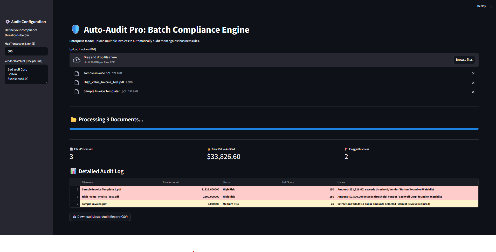

# 🛡️ Auto-Audit Pro
**Batch Financial Compliance Engine built with Python & Streamlit**

Auto-Audit Pro automates the auditing of financial documents. It ingests PDF invoices, extracts structured data using OCR, and runs them against configurable business logic (e.g., "Flag transactions > $500" or "Detect Blacklisted Vendors").



## 🚀 Key Features
* **Batch Processing:** Upload 50+ invoices simultaneously for bulk auditing.
* **Risk Scoring Algorithm:** Automatically assigns "Low," "Medium," or "High" risk scores based on value and vendor reputation.
* **Regex Pattern Matching:** Detects currency values with or without symbols (e.g., `$500` or `500 USD`).
* **Interactive Dashboard:** View real-time metrics (Total Value Audited, Flagged Invoices).
* **Data Export:** Download a structured CSV report for further analysis in Excel.

## 🛠️ Tech Stack
* **Core:** Python 3.10+
* **Frontend:** Streamlit
* **Data Extraction:** pdfplumber, RegEx
* **Data Handling:** Pandas

## 💻 How to Run Locally
1. Clone the repository:
   ```bash
   git clone https://github.com/Arnav184-arnav184/Auto-Audit-Pro.git
   ```

2. Navigate to the project folder:
   ```bash
   cd Auto-Audit-Pro
   ```

3. Install dependencies:
   ```bash
   pip install -r requirements.txt
   ```

4. Run the app:
   ```bash
   streamlit run app.py
   ```

## 🔮 Future Improvements
* **LLM Integration:** Replace Regex with GPT-4 Vision for better spatial layout analysis on non-standard invoices.
* **Database Integration:** Connect to SQL to store historical audit logs rather than just CSV exports.

---
*Created by [Arnav Hazari](https://www.linkedin.com/in/arnav-hazari)*

